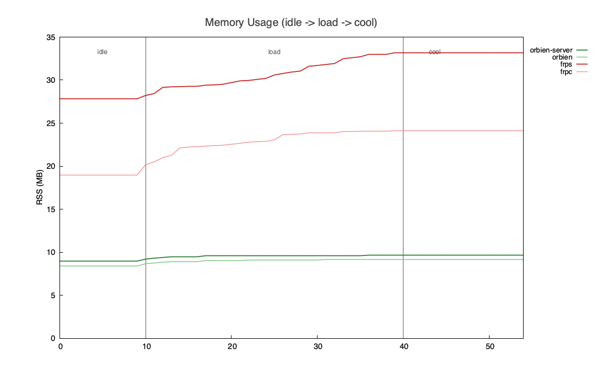

<div align="center">
  
</div>
<p align="center" style="font-size:18px;color:#555;margin-top:-10px;margin-bottom:24px;">
  
  NAT traversal built with Rust and Tokio
</p>
<div align="center">
  <a href="https://github.com/zzzhoo1/orbien/stargazers">
    
  </a>
  <a href="https://github.com/zzzhoo1/orbien/forks">
    
  </a>
  <a href="https://github.com/zzzhoo1/orbien/issues">
    
  </a>
  <a href="https://github.com/zzzhoo1/orbien/blob/main/LICENSE">
    
  </a>
  <a href="https://www.rust-lang.org/">
    
  </a>
  <a href="https://github.com/zzzhoo1/orbien/releases">
    
  </a>
  <a href="https://somsubhra.github.io/github-release-stats/?username=zzzhoo1&repository=orbien">
    
  </a>
  <a href="https://discord.gg/4dgQjCS3k">
    
  </a>
</div>

<div align="center">
  <a href="https://trendshift.io/repositories/128255?utm_source=trendshift-badge&amp;utm_medium=badge&amp;utm_campaign=badge-trendshift-128255" target="_blank" rel="noopener noreferrer"></a>
</div>

<div align="center">
  <a href="README.md"><strong>English</strong></a> &nbsp;|&nbsp;
  <a href="README_ZH.md"><strong>简体中文</strong></a>
  &nbsp;|&nbsp;
  <a href="https://orbien-org.github.io/orbien/"><strong>Docs</strong></a>
</div>


A lightweight, high-performance, and secure intranet penetration tool with a binary size of around `5MB`.

## Features

- **High performance**: high performance, packet-loss resilient, high throughput, no GC pauses, and low memory usage
- **Tunnel protocols**: TCP, UDP, HTTP, HTTPS,SOCKS5 and more
- **Transport protocols**: TCP, KCP, WebSocket, QUIC, with TCP multiplexing support
- **Security**: Token-based tunnel authentication, TLS and mTLS encryption; HTTPS supports transparent forwarding and client-side TLS termination
- **Cross-platform**: Windows, Linux, macOS, FreeBSD, and more
- **Operations**: lightweight Web admin UI and cross-platform desktop client for easy configuration and monitoring

## Quick Start

[Download](https://github.com/orbien-org/orbien/tags) the binary archive for your platform and extract it.

### Server

```toml
# orbien-server.toml
listen = "0.0.0.0:9527"
```

```shell
./orbien-server -c orbien-server.toml
```

### Client

```toml
# orbien.toml
server = "127.0.0.1:9527"

[[tunnels]]
name = "ssh"
protocol = "tcp"
service = "127.0.0.1:22"
remotePort = 9000
```

```shell
./orbien -c orbien.toml
```

If you prefer not to use the CLI, try the [Orbien-Desktop](https://github.com/zzzhoo1/orbien/releases) desktop client — built with `Tauri`, under `10MB`.


## Benchmark


| Env | Details |
|-----|---------|
| Platform | macOS 26.2 · Darwin 25.2.0 · arm64 |
| Hardware | Apple M2 (8 cores) · 16 GB |
| Details | [benchmarks](https://github.com/orbien-org/benchmarks) |

To rule out various sources of interference, these benchmarks were run on local loopback. Compared with `frp`, Orbien's clearest advantage is lower and steadier memory usage under high concurrency.




## License

- [Apache License 2.0](https://github.com/orbien-org/orbien/blob/main/LICENSE)

## Contact

- Issues: [issues](https://github.com/orbien-org/orbien/issues)
- Community: [discord](https://discord.com/invite/4dgQjCS3k)
