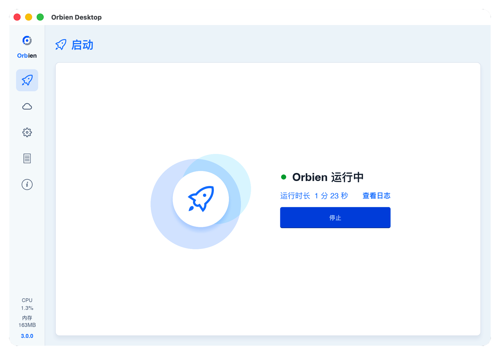

<div align="center">
  
</div>
<p align="center" style="font-size:18px;color:#555;margin-top:-10px;margin-bottom:24px;">
  基于 Rust 和 Tokio 实现的内网穿透
</p>
<div align="center">
  <a href="https://github.com/zzzhoo1/orbien/stargazers">
    
  </a>
  <a href="https://github.com/zzzhoo1/orbien/forks">
    
  </a>
  <a href="https://github.com/zzzhoo1/orbien/issues">
    
  </a>
  <a href="https://github.com/zzzhoo1/orbien/blob/main/LICENSE">
    
  </a>
  <a href="https://www.rust-lang.org/">
    
  </a>
  <a href="https://github.com/zzzhoo1/orbien/releases">
    
  </a>
  <a href="https://somsubhra.github.io/github-release-stats/?username=zzzhoo1&repository=orbien">
    
  </a>
  <a href="https://discord.gg/4dgQjCS3k">
    
  </a>
</div>

<div align="center">
  <a href="https://trendshift.io/repositories/128255?utm_source=trendshift-badge&amp;utm_medium=badge&amp;utm_campaign=badge-trendshift-128255" target="_blank" rel="noopener noreferrer"></a>
</div>

<div align="center">
  <a href="README.md"><strong>English</strong></a> &nbsp;|&nbsp;
  <a href="README_ZH.md"><strong>简体中文</strong></a>
  &nbsp;|&nbsp;
  <a href="https://orbien-org.github.io/orbien/"><strong>文档</strong></a>
</div>


一个轻量、高性能、安全的内网穿透工具，二进制体积 `5MB`左右

## 功能特性

- **高性能**：高性能，抗丢包、高吞吐、无GC停顿、内存占用低
- **隧道协议**：支持 TCP、UDP、HTTP、HTTPS、SOCKS5 等多种协议隧道
- **传输协议**：支持 TCP、KCP、WebSocket、QUIC，支持TCP多路复用
- **安全加密**：支持 Token 隧道鉴权以及Tls和mTLS加密传输；HTTPS采用透明转发和客户端TLS终止
- **多平台支持**：支持 Windows、Linux、macOS、freeBSD 等多平台
- **运维管理**：提供轻量Web管理界面和跨平台原生桌面客户端，便于配置和监控

## 快速开始

[下载](https://github.com/orbien-org/orbien/tags)对应平台的二进制压缩包解压

### 服务端

```toml
# orbien-server.toml
listen = "0.0.0.0:9527"
```

```shell
./orbien-server -c orbien-server.toml
```

### 客户端

```toml
# orbien.toml
server = "127.0.0.1:9527"

[[tunnels]]
name = "ssh"
protocol = "tcp"
service = "127.0.0.1:22"
remotePort = 9000
```

```shell
./orbien -c orbien.toml
```

如果觉得命令行CLI操作麻烦，可以使用 [Orbien-Desktop](https://github.com/zzzhoo1/orbien/releases) 桌面端，该桌面端基于
`Tauri`框架开发，体积不到`10MB`



## 性能测试

| 环境 | 说明                                                     |
|----|--------------------------------------------------------|
| 平台 | macOS 26.2· Darwin 25.2.0 · arm64                      |
| 硬件 | Apple M2（8 核）· 16 GB                                   |
| 详细 | [benchmarks](https://github.com/orbien-org/benchmarks) |

为了排除各种干扰因素，本测试是在本地回环下进行，相较于`frp`，`Orbien`比较明显的优势是在高并发条件下内存占用更低、更加平稳。


本项目参考了[frp](https://github.com/fatedier/frp)
的架构思路，桌面客户端UI布局借鉴[frpc-desktop](https://github.com/luckjiawei/frpc-desktop)的交互，感谢开源社区的贡献。

## 许可证

- [Apache License 2.0](https://github.com/orbien-org/orbien/blob/main/LICENSE)

## 联系

- 问题反馈：[issues](https://github.com/orbien-org/orbien/issues)
- 交流群：[discord](https://discord.com/invite/4dgQjCS3k)
