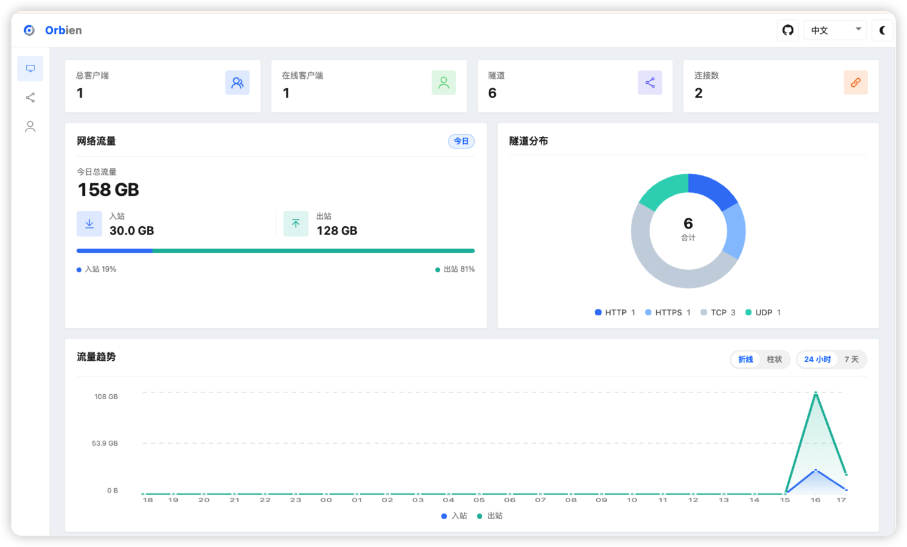

<div align="center">
  
</div>
<p align="center" style="font-size:18px;color:#555;margin-top:-10px;margin-bottom:24px;">
  基于 Rust 和 Tokio 的内网穿透
</p>
<div align="center">
  <a href="https://github.com/zzzhoo1/orbien/stargazers">
    
  </a>
  <a href="https://github.com/zzzhoo1/orbien/forks">
    
  </a>
  <a href="https://github.com/zzzhoo1/orbien/issues">
    
  </a>
  <a href="https://github.com/zzzhoo1/orbien/blob/main/LICENSE">
    
  </a>
  <a href="https://www.rust-lang.org/">
    
  </a>
  <a href="https://github.com/zzzhoo1/orbien/releases">
    
  </a>
  <a href="https://somsubhra.github.io/github-release-stats/?username=zzzhoo1&repository=orbien">
    
  </a>
  <a href="https://discord.gg/4dgQjCS3k">
    
  </a>
</div>

<div align="center">
  <a href="README.md"><strong>English</strong></a> &nbsp;|&nbsp;
  <a href="README_ZH.md"><strong>简体中文</strong></a>
  &nbsp;|&nbsp;
  <a href="https://orbien-org.github.io/orbien/"><strong>文档</strong></a>
</div>



一个轻量、高性能、安全的内网穿透工具，二进制体积 `5MB`左右

## 功能特性

- **高性能**：全链路零拷贝转发，低延迟、高吞吐、无GC停顿、内存占用低
- **代理协议**：支持 TCP、UDP、HTTP、HTTPS等多种协议代理
- **传输协议**：支持 TCP、KCP、WebSocket、QUIC，支持TCP多路复用
- **安全加密**：支持 Token 隧道鉴权以及Tls和mTLS加密传输；HTTPS采用透明转发和客户端TLS终止
- **多平台支持**：支持 Windows、Linux、macOS、freeBSD 等多平台
- **运维管理**：提供轻量Web管理界面和跨平台桌面客户端，便于配置和监控

## 快速开始

[下载](download.mdx)对应平台的二进制压缩包解压

### 服务端

```toml
# orbien-server.toml
bindAddr = "0.0.0.0"
bindPort = 9527
```

```shell
./orbien-server -c orbien-server.toml
```

### 客户端

```toml
# orbien.toml
serverAddr = "127.0.0.1"
serverPort = 9527

[[proxies]]
name = "mysql"
type = "tcp"
localIP = "127.0.0.1"
localPort = 3306
remotePort = 6050
```

```shell
./orbien -c orbien.toml
```

如果觉得命令行CLI操作麻烦，可以使用 [Orbien-Desktop](https://github.com/zzzhoo1/orbien/releases) 桌面端，该桌面端基于
`Tauri`框架开发，体积不到`10MB`


# 性能测试

下图是基于本地回环进行的测试结果，可以发现`Orbien`的内存占用非常低且稳定。


# 致谢

本项目参考了[frp](https://github.com/fatedier/frp)
的架构思路，桌面客户端UI布局借鉴[frpc-desktop](https://github.com/luckjiawei/frpc-desktop)的交互，感谢开源社区的贡献。
