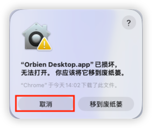

# 桌面客户端

## 安装问题

### macOS 无法打开或提示已损坏




下载的 `.app` / `.dmg` 可能被系统隔离，若无法打开，或提示应用已损坏，在终端执行：

```shell
xattr -cr "/Applications/Orbien Desktop.app"
open "/Applications/Orbien Desktop.app"
```

若安装路径不同，将上面路径换成实际 `.app` 位置后再执行。
