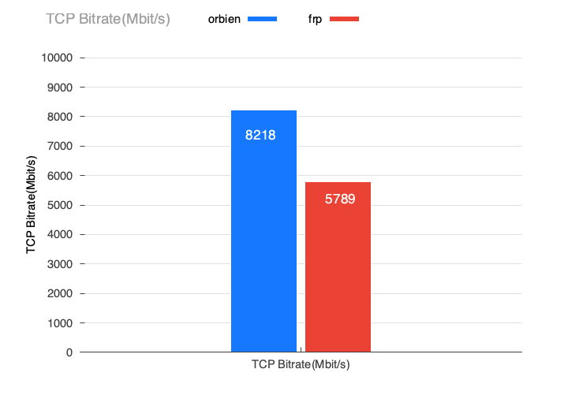
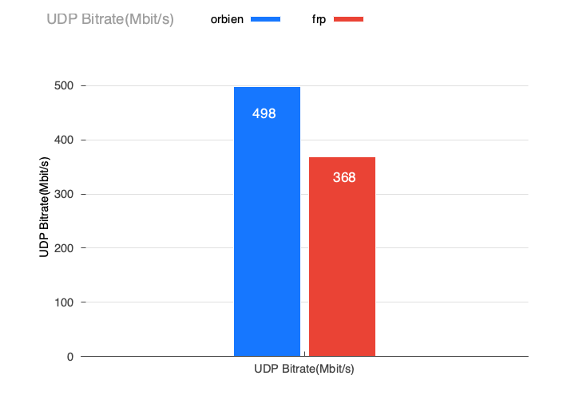

# Performance

| Env | Details |
|-----|---------|
| Platform | macOS 26.2 · Darwin 25.2.0 · arm64 |
| Hardware | Apple M2 (8 cores) · 16 GB |
| Details | [benchmarks](https://github.com/orbien-org/benchmarks) |

To rule out various sources of interference, these benchmarks were run on local loopback. Compared with `frp`, Orbien's clearest advantage is lower and steadier memory usage under high concurrency.

